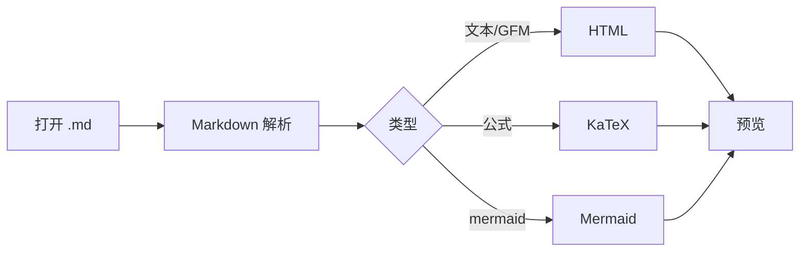
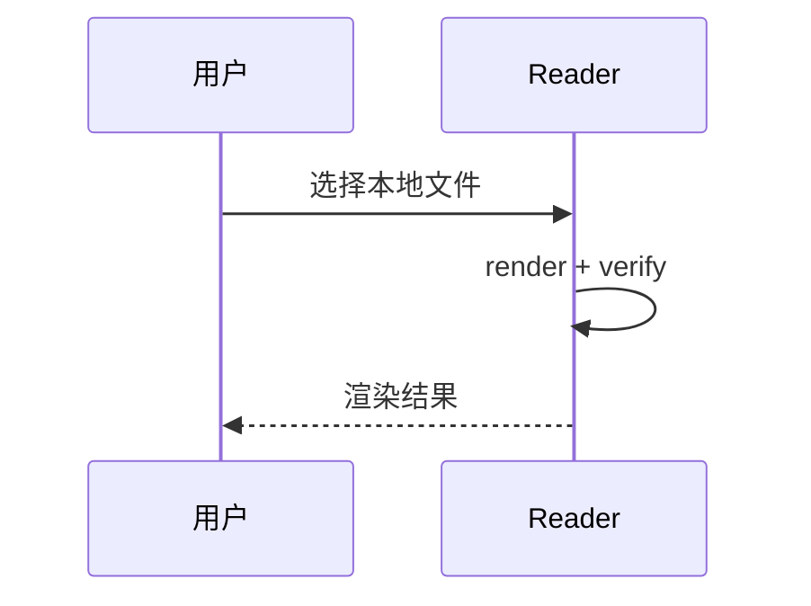

# Markdown Reader 样例

轻量本地预览：**GFM** · **Mermaid** · **KaTeX**

## 通用 Markdown

- 列表项一
- 列表项二
  1. 有序 A
  2. 有序 B

> 引用：本地打开 `.md` 即可预览。

行内代码：`const x = 1`，链接：https://example.com

| 语法 | 支持 |
|------|------|
| 表格 | ✅ |
| 代码高亮 | ✅ |
| 公式 | ✅ |
| 图示 | ✅ |

```ts
function greet(name: string) {
  return `Hello, ${name}`
}
```

## 公式

行内：质能方程 $E = mc^2$，积分 $\int_0^1 x^2\,dx = \frac{1}{3}$。

块级：

$$
\begin{aligned}
\nabla \cdot \mathbf{E} &= \frac{\rho}{\varepsilon_0} \\
i\hbar\frac{\partial}{\partial t}\Psi &= \hat{H}\Psi
\end{aligned}
$$

## 图示（Mermaid）




